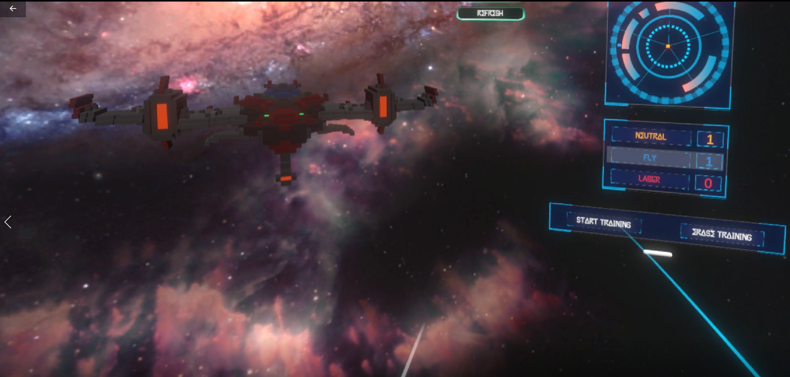
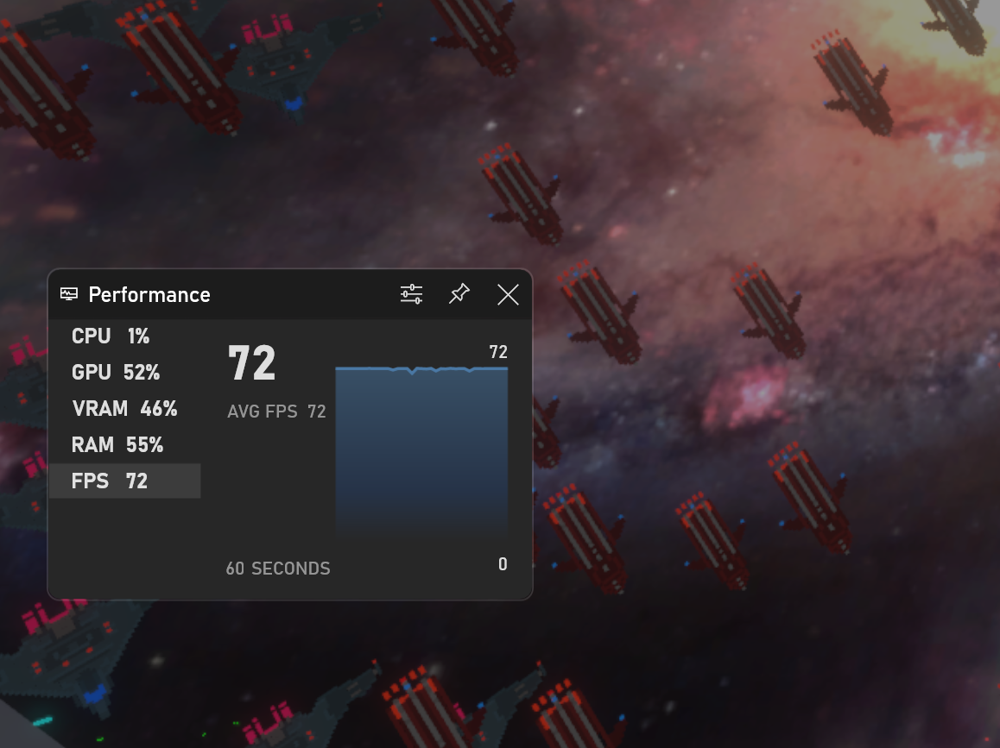

# Aliens V/S Laser Knights
#### A game by Jasfiq Rahman
*Assignment 02 of 3D Games Programming | MSc Game Development (Programming) | Kingston University*

## Introduction
Welcome to my project! The objective of this undertaking is to leverage the Emotiv EEG headset and Cortex API to develop a gaming application with a principal input modality centered on mind-controlled machine interaction.

The project is released under the MIT license, granting you the freedom to repurpose it as you see fit (a little credit would be appreciated, as it goes a long way in supporting my work).

### Project Overview
For a brief overview of the project, check out the [YouTube video](https://youtu.be/HWJ2hlBIkfE) where I delve into its key aspects. This video provides insights into the project's goals, development process, and some exciting highlights.

For your convenience, a build of the project is available for download on my [itch.io](https://jasfreaq.itch.io/aliens-vs-laser-knights) page. To play the game you will need to have an Emotiv account (and a headset of course). Simply log in to the Emotiv Launcher and connect your headset. You will also need a VR headset of your choice for the game. In my experience I found that keeping the VR headset a bit loose so that it doesnt apply a lot of pressure on Emotiv's headset yields better response rates.

### Explore My Portfolio
If you're interested in learning more about who I am and the range of projects I work on, feel free to explore my [portfolio](https://jasfiq-rahman.com/). There, you'll find additional details about my background, skills, and a showcase of other projects I've undertaken.

Feel free to dive in, repurpose, and explore the possibilities that this project offers. Your curiosity and creativity are always encouraged!

## Content
- [Problem Statement](#problem-statement)
- [User Instructions](#user-instructions)
- [Entity Component System to optimize Enemy Behaviour](#entity-component-system-to-optimize-enemy-behaviour)
- [Design Patterns for enhanced Architectural Solutions](#design-patterns-for-enhanced-architectural-solutions)
- [Cortex API Classes](#cortex-api-classes)
- [ECS System Archetypes](#ecs-system-archetypes)
- [Performance](#performance)
- [References](#references)
- [Assets Used](#assets-used)

## Problem Statement
While previous projects utilizing similar technology have been demonstrated on Emotiv's official YouTube channel[[1]](#references), many exhibit a lack of cohesion in terms of both scope and scale.

Distinguishing itself from these instances, this project stands out due to its incorporation of Virtual Reality (VR) technology. This integration aims to deliver a gaming experience that authentically embodies a futuristic paradigm.

Consequently, the central challenge inherent in this initiative has been the seamless amalgamation of these two technologies, thereby producing a solution that transcends the realm of science fiction, a concept that has captivated imaginations for decades.

## User Instructions
Users must undergo training to proficiently use their minds for interaction in the game. Simultaneously, the system adapts to each user's unique brain patterns, enhancing player control precision.

To streamline this process, my solution incorporates an in-game training level. This enables users to familiarize themselves with the system in a context aligned with the natural gameplay of the project. 

Emotiv's Cortex API enables the training scene with a user interface similar to the BCI application, offering immediate feedback and guiding users on strategy adjustments.

As a rule of thumb, the following two strategies are recommended by Emotiv[[2]](#references):
- Each action produces a distinct pattern from every other action.
- The visualizations should be easy to reproduce each time.

## Entity Component System to optimize Enemy Behaviour
This project strategically employs Unity's Entity Component System (ECS) and Data-Oriented Technology Stack (DOTS) to enhance the efficiency of simulating in-game enemies.

Given the game's classification within the bullet-hell genre, the scene accommodates a considerable number of enemy objects, often numbering in the hundreds simultaneously.

The inherent complexity of managing numerous entities in conjunction with the immersive Virtual Reality environment introduces the potential for disorienting lags during gameplay.

To address this challenge, the utilization of ECS and DOTS serves to optimize the processing and rendering of enemy entities, mitigating performance bottlenecks and ensuring a smoother and more immersive gaming experience for the player.

## Design Patterns for enhanced Architectural Solutions
In order to facilitate interaction between the player's monobehaviours and the ECS in the scene, I established singleton entities that autonomously update based on the player's game state. These entities encompass aspects such as the player's transform, health, etc. A script manages the bidirectional information flow between the traditional monobehaviour architecture and the ECS, establishing a cohesive hybrid framework for interaction.

Singletons, in conjunction with the flyweight pattern, efficiently cache diverse enemy ship prefabs, projectiles, and particles within a unified entity. This not only mitigates memory consumption but also establishes a centralized referencing method for enemy entities.

I considered object pooling for enemies but deferred due to the optimized ECS instantiation pipeline, prioritizing simplicity and time considerations. It remains a potential enhancement for future frame-rate optimization.

## Cortex API Classes
The **EmotivUnityItf.cs** is the primary liaising class between the Cortex Unity plugin and the Cortex framework for interactions. However, it is noteworthy that the plugin, in its current state, is not entirely production-ready and requires enhancements. As such, substantial effort was directed towards establishing the requisite functionality for the training interface. Fortunately, the plugin provided a helpful framework, saving us from having to build everything from scratch.

The **EmotivTrainingInterfacer.cs** is the class responsible for handling the training interface of the game. Its functions encompass the initialization of the Emotiv system, management of callbacks, subscription to data streams, and subsequent UI updates.

The **EmotivGameplayInterfacer.cs** class is designed for gameplay and shares most features with the training interfacer. Unlike the training aspect, it focuses solely on processing player input for gameplay by subscribing to the 'Mental Command' data stream.

## ECS System Archetypes
In my project, systems handle entity creation and updates. If instantiation parameters rely on update systems, they're added to a DynamicBuffer in the spawner during the update loop. Entities are then instantiated in the next update of the **InitializationSystemGroup**, followed by buffer clearance.

For example: the **OrbitSpawnerSystem.cs** creates Orbits, leading to the spawning of Satellites by **SatelliteSpawnerSystem.cs**. The positions of satellites are managed by the **SatelliteOrbitingSystem.cs**, within which when conditions for laser spawning are met, a **MissileSpawnElement** is added to the buffer. The **MissileSpawnerSystem.cs** subsequently spawns the lasers, and their positions are updated by the **LaserLocomotionSystem.cs**.

Two crucial systems include **CollisionEventsSystem.cs** and **TriggerEventsSystem.cs**. These classes play a pivotal role in managing collisions between player and enemy entities.

## Performance
By leveraging ECS, Unity efficiently manages the instantiation, updates, and interactions of numerous objects in the VR environment. The screenshot serves as a visual testament to the effectiveness of Unity's ECS in handling the computational demands of the project, ensuring a smooth and immersive user experience.

## References
[1] emotivstation, Games. [Online video playlist]. Available: https://youtube.com/playlist?list=PLAf9lWfzX4jBrEaA3K-xLs1Zq8FiRmN-I&si=B316D4HxbJIijgGh.

[2] Emy Nguyen, “Tips on Mental Command training.” EMOTIV. [Online article]. Available: https://www.emotiv.com/knowledge-base/tips-on-mental-command-training/. Accessed: December 10, 2023.

[ChatGPT](https://chat.openai.com/) for proofreading and editing.

## Assets Used
- [Pink Bloom Synthwave Music Pack](https://davidkbd.itch.io/pink-bloom-synthwave-music-pack)
- [200 Free SFX](https://kronbits.itch.io/freesfx)
- [Space Motors](https://lesound.itch.io/spacemotors)
- [Free Shield 3D Low Poly Pack](https://free-game-assets.itch.io/free-shield-3d-low-poly-models)
- [Low Poly Elvish Blade](https://t-allen-studios.itch.io/low-poly-elvish-blade)
- [UI Buttons & Scrolling bars Pixel art](https://gowldev.itch.io/ui-buttons-scrolling-bars-pixel-art)
- [Voxel Spaceships Collection](https://maxparata.itch.io/voxel-spaceships)
- [Space HUD Vector UI Pack](https://ilkaytobello.itch.io/space-hud-vector)
- [Interstellar EDM/Metal Music Pack](https://davidkbd.itch.io/interstellar-edm-metal-music-pack)
- [Volumetric Lines](https://assetstore.unity.com/packages/tools/particles-effects/volumetric-lines-29160)
- [Cruise Missile PBR](https://assetstore.unity.com/packages/3d/props/weapons/cruise-missile-pbr-153933)
- [Loomattic Font](https://www.fontspace.com/loomattic-font-f85245)
- [Halo Domas Font](https://www.fontspace.com/halo-domas-font-f85197)
- [Space Fleet (Sci-fi orchestral music)](https://pixabay.com/music/main-title-space-fleet-sci-fi-orchestral-music-166953/)